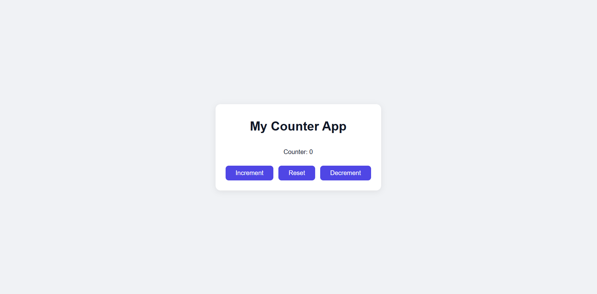

# 🧮 Counter App (React)

## 📌 Project Overview
A modern and responsive **Counter Application** built using React.  
This app allows users to increment, decrement, and reset the counter with a clean UI and smooth user experience.

---

## 🚀 Features
- ➕ Increment the counter value
- ➖ Decrement the counter value
- 🔄 Reset counter to default (0)
- 🎨 Modern and clean UI design
- 📱 Fully responsive (works on mobile, tablet, desktop)
- ⚡ Fast and lightweight React implementation

---

## 🛠️ Tech Stack
- React (Functional Components)
- JavaScript (ES6+)
- CSS (Flexbox / Responsive Design)

---

## 💡 How It Works
- The counter state is managed using React's `useState` hook.
- Clicking buttons updates the state dynamically.
- UI updates automatically based on state changes.

---

## 📸 Preview

