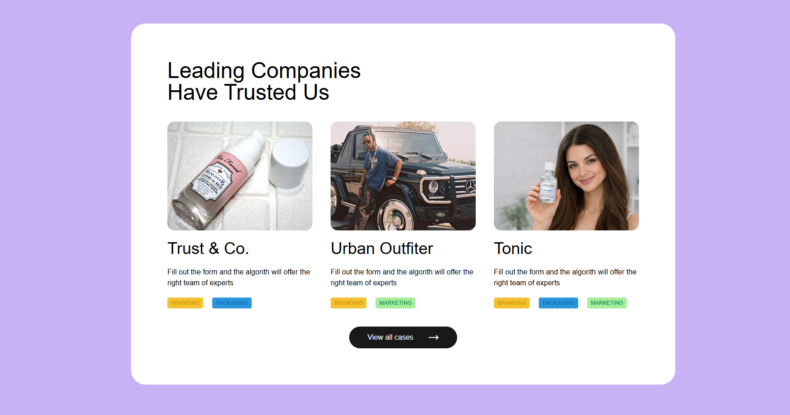

# Minimal UI Layout

A simple minimal UI layout built using React, Vite, and Tailwind CSS.

## 🚀 Tech Stack

- React
- Vite
- Tailwind CSS

## ✨ Features

- Clean modern UI
- Reusable components
- Tailwind styling

## 📸 Screenshot

## 📚 Purpose

This project was created to practice frontend UI design and component structuring using React and Tailwind CSS.