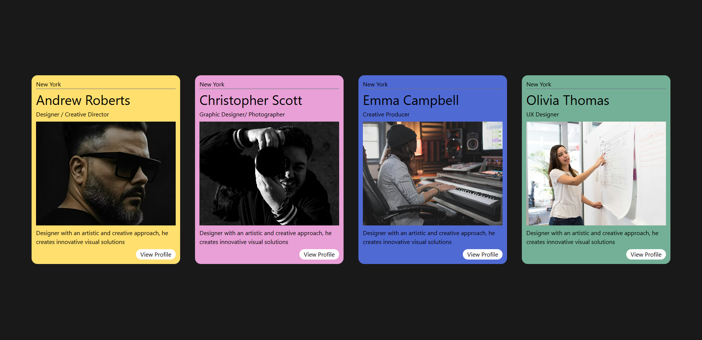

# Simple Cards UI

A clean and responsive Cards UI project built using React and Tailwind CSS.

---

# Screenshot



> Replace the image path with your actual screenshot filename/path.

Example:

```bash
./src/assets/project-preview.png
```

---

# Features

- Responsive Cards Layout
- Modern Minimal UI
- Smooth Hover Effects
- Reusable Components
- Tailwind CSS Styling
- Beginner Friendly Project

---

# Tech Stack

- React
- Vite
- Tailwind CSS

---

# Installation

Clone the repository:

```bash
git clone <your-repo-link>
```

Navigate to project folder:

```bash
cd 04-Minimal-UI-project
```

Install dependencies:

```bash
npm install
```

Run the development server:

```bash
npm run dev
```

---

# Folder Structure

```bash
src/
│
├── assets/
│   └── screenshot.png
│
├── components/
│   └── Card.jsx
│
├── App.jsx
├── main.jsx
└── index.css
```
---


---

# Author

Made with ❤️ using React & Tailwind CSS