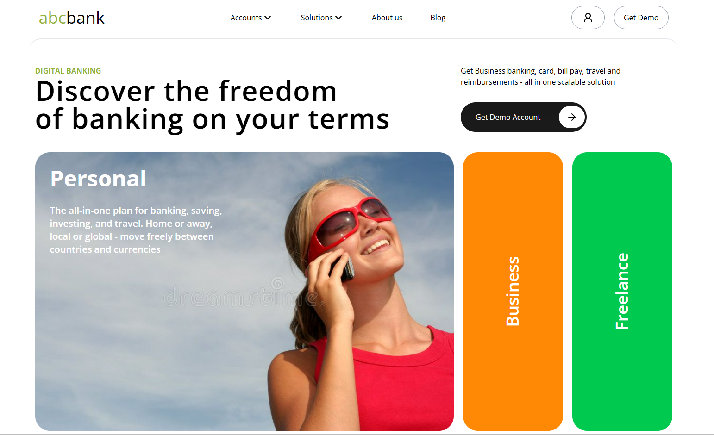

# UI Landing Page

A simple modern UI project built using React, Vite, and Tailwind CSS.

This project focuses only on frontend design and layout styling.  
No backend or functionality has been added yet.

---

## 🚀 Tech Stack

- React
- Vite
- Tailwind CSS

---

## ✨ Features

- Clean UI design
- Tailwind CSS styling
- Reusable React components
- Smooth spacing and typography9

---

## 📸 Screenshot



> Replace the image path with your actual screenshot path.

---

## 📦 Installation

Clone the repository:

```bash
git clone <your-repo-link>
```

Install dependencies:

```bash
npm install
```

Run the development server:

```bash
npm run dev
```

---

## 📁 Project Structure

```bash
src/
 ├── components/
 ├── assets/
 ├── App.jsx
 ├── main.jsx
```

---

## 🎯 Purpose

This is my first UI project created for practicing:
- React component structure
- Tailwind CSS
- Responsive layouts
- Modern UI styling

---

## 👨‍💻 Author

Made with React + Tailwind CSS.
